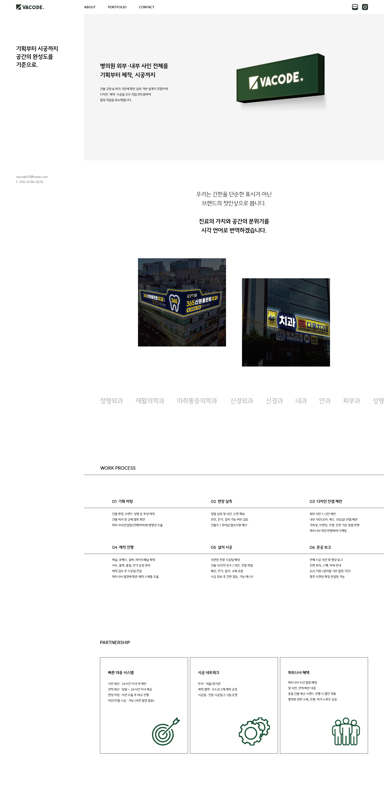
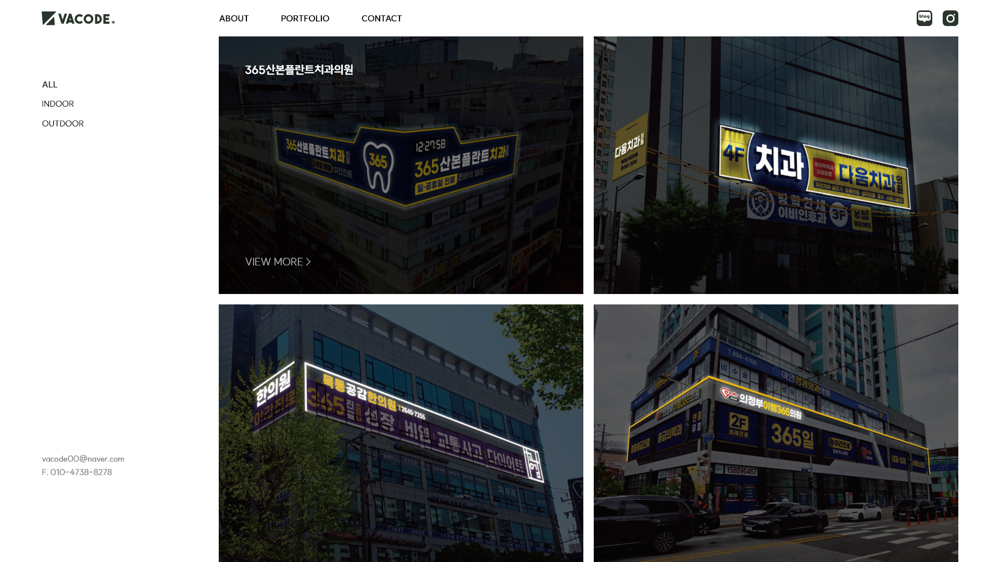
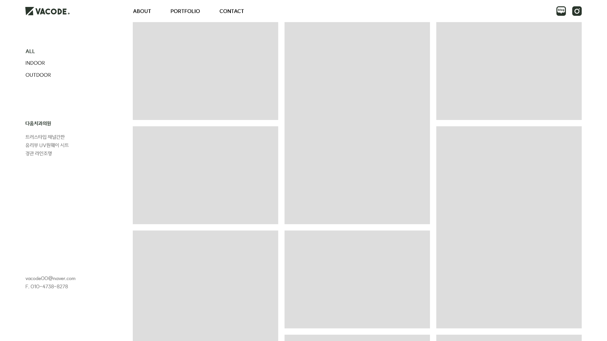
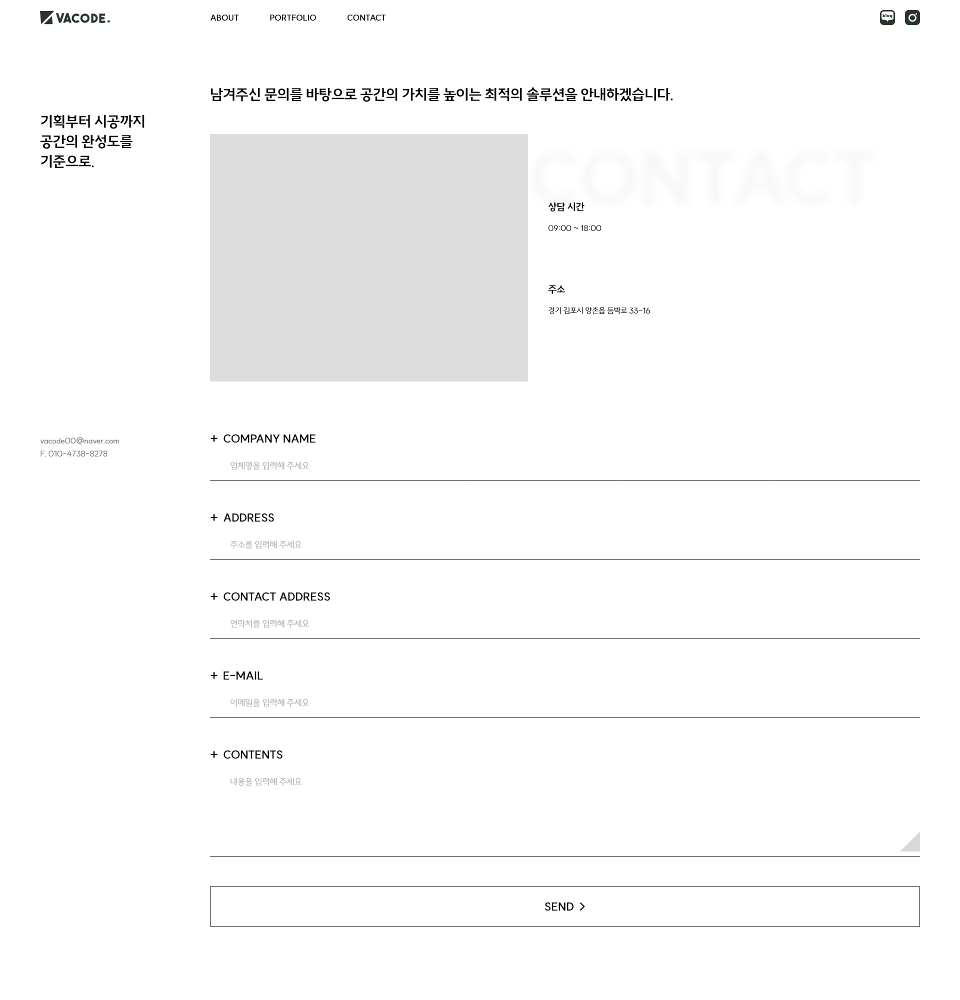

# VACODE - Cafe24 스킨 개발 프로젝트

**VACODE** 카페24 쇼핑몰 스킨 개발 및 관리 프로젝트

## 📁 디렉토리 구조 및 역할

이 프로젝트는 디자이너와 협업하며 크게 **로컬 개발용 파일**과 **카페24 업로드용 스킨 파일** 두 가지 버전으로 관리.

```text
📦 (Root)
 ┣ 📂 cafe24_skin/     # 카페24 서버에 실제로 업로드되는 스마트디자인 스킨 버전 (카페24 전용 태그 포함)
 ┣ 📂 VACODE/          # VACODE 관련 리소스 및 에셋
 ┣ 📂 css/             # 로컬 개발용 스타일시트
 ┣ 📂 img/             # 로컬 개발용 이미지 리소스
 ┣ 📂 asset/           # 공통 에셋 폴더
 ┣ 📜 index.html       # 로컬 환경에서 퍼블리싱 테스트용 메인 페이지
 ┣ 📜 about.html       # 로컬 환경에서 퍼블리싱 테스트용 서브 페이지
 ┗ 📜 README.md
```

### 1. 로컬 환경 (Root Directory)
- `index.html`, `about.html` 등 최상단에 있는 HTML 파일들은 **카페24 전용 모듈 태그(`<!--@...-->` 등)가 없는 바이브 코딩으로 작성된 순수 HTML/CSS/JS** 파일.
- 바이브 코딩으로 로컬 환경에서 빠른 퍼블리싱 작업, UI/UX 검토 및 다양한 디바이스 해상도(반응형) 테스트 등을 진행하기 위한 목적.

### 2. 카페24 스킨 환경 (`cafe24_skin/`)
- 로컬에서 퍼블리싱이 완료된 코드를 바탕으로 **카페24 스마트디자인 전용 태그와 모듈 코드를 결합**한 파일들이 위치.
- 카페24 FTP나 스마트디자인 편집창을 통해 실제로 쇼핑몰에 적용되는 파일들.

---

## 🛠 작업 워크플로우 (Workflow)

1. **로컬 개발 (Local Development)**
   - 루트 폴더의 `index.html`, `css/`, `img/` 등을 수정하여 UI/UX 및 퍼블리싱 작업을 진행.
   - 로컬 브라우저에서 직접 열어보고 디자인과 동작을 확인.
2. **카페24 스킨 적용 (Apply to Cafe24 Skin)**
   - 퍼블리싱이 완료된 코드를 `cafe24_skin/` 폴더 내의 해당 파일(예: `index.html` 또는 레이아웃 파일)로 이동.
   - 필요한 경우 카페24의 데이터 출력 모듈 태그(예: 상품 목록, 게시판 등)를 훼손하지 않도록 주의하여 HTML 구조와 CSS 클래스를 적용.
3. **업로드 및 확인 (Deploy to Cafe24)**
   - 수정된 `cafe24_skin/` 내부의 파일들을 카페24 FTP (또는 웹FTP, 스마트디자인 편집기)를 통해 업로드.
   - 실제 카페24 쇼핑몰 도메인으로 접속하여 데이터가 정상적으로 연동되어 출력되는지 테스트.

---

## 💻 Tech Stack
- **Frontend:** HTML5, CSS3, Vanilla JavaScript
- **Platform:** Cafe24 Smart Design

## 📌 주의사항
- `cafe24_skin/` 내의 파일들을 로컬에서 열 경우, 카페24 모듈 태그가 렌더링되지 않아 화면이 깨져 보일 수 있음. 이는 정상이며 실제 서버 환경에서 확인.
- 공통 CSS나 JS를 수정할 때에는 두 환경(로컬/카페24) 모두에 적용되도록 관리하거나, 경로 설정에 유의.

---

## 🎨 디자인 시안 (UI Design)

<details>
<summary><b>1. Main Page (클릭하여 펼치기)</b></summary>
<br>

</details>

<details>
<summary><b>2. About Page (클릭하여 펼치기)</b></summary>
<br>

</details>

<details>
<summary><b>3. Portfolio - 게시판 (클릭하여 펼치기)</b></summary>
<br>

</details>

<details>
<summary><b>4. Portfolio - 게시물 (클릭하여 펼치기)</b></summary>
<br>

</details>

<details>
<summary><b>5. Contact Page (클릭하여 펼치기)</b></summary>
<br>

</details>
